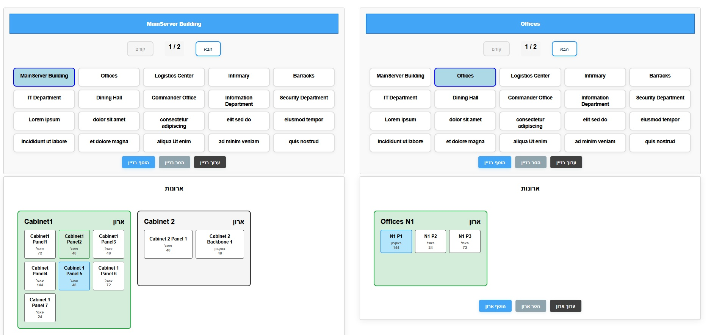
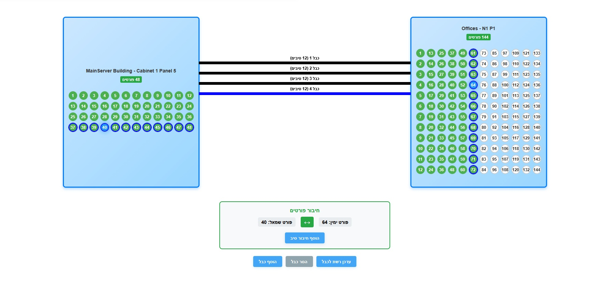
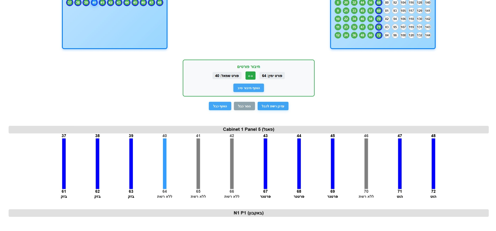

A backend service for managing network infrastructure data — buildings, cabinets, fiber optic cables, ports, and network assignments.
Features:
- Full API for creating, retrieving, connecting, updating, deleting operations for each component in the system.
- PostgreSQL-enforced referential integrity and cascading behavior
---
Architecture
| Component             | Technology      |
| --------------------- | --------------- |
| Web API               | Python + Flask  |
| Database              | PostgreSQL      |
| CORS                  | `flask-cors`    |
| Database Connector    | `psycopg2`      |
| Environment Variables | `python-dotenv` |

---

Requirements

Install dependencies:
1. pip install -r requirements.txt
2. Ensure PostgreSQL is installed and running
3. Create the an empty database
4. Run the app
---
How to use
- **Input Buildings**: For each building create cabinets. A cabinet may be a standalone panel, or a rack which only houses panels.

- **Panels are endpoints for connections**: choose two panels and create a cable between them.

- **Networks**: Choose a network for all fibers in a cable, or input networks for individual fibers.

   
